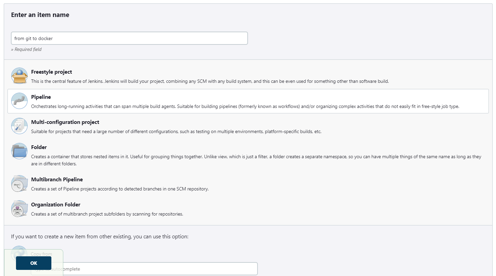

# from_git_to_docker
bla bla

## Structure
```
from_git_to_docker/
|
├── Dockerfile
├── Jenkinsfile
├── docker-compose.yml
├── main.py
└── README.md
```

- Dockerfile - the dockerfile of the jenkins container that is deployed. also installs python in the container.
- Jenkinsfile - the jenkinsfile that contains the stages the jenkins agent will do whenever the pipeline is activeted.
- docker-compose.yml - the docker-compose file that deploys the jenkins container from its dockerfile.
- main.py - the python script that runs by the pipeline (according to the jenkinsfile).

## Getting Started
### prerequisites
First, make sure you have docker and docker-compose.
If you want to clone this repo, download and use git if you haven't already.
The dockerfile pulls image from dockerhub so also check you are connected to the internet \ to your image repo (if its your private image repo, make sure you have the image that is pulled with the same name).

### Usage
1. Clone the repo
```
git clone https://github.com/Sh4peSh1fter/from_git_to_docker.git
```
2. Run the docker-compose to deploy the containers. Make sure you are in the same folder with the docker-compose.yml.
```
cd from_git_to_docker
docker compose up
```
3. After the docker-compose finished successfuly, visit http://127.0.0.1:8080/, and finish the jenkins setup.
4. Create new pipeline (the name doesn't metter)

5. In the "Pipeline" section, pick the "pipeline script from SCM". Under that pick "Git" as your SCM and enter the git repo you want to be connected with in the "repositoriy URL".
If the repo is public you can leave the "credentials" as none. Dont forget to save.
